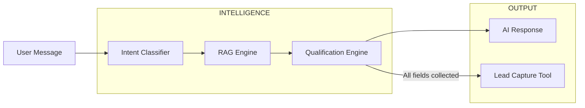

<h1 align="center">🤖 AutoStream AI Sales Agent</h1>
<h3 align="center">⚡ Conversational AI that Converts Users into Qualified Leads</h3>

<p align="center">
  
  
  
  
</p>

<p align="center">
  <b>🧠 Understand → 💬 Converse → 🎯 Qualify → 📋 Capture Leads</b>
</p>

---

## 🎥 Live System Flow

```
User Message → Intent Detection → RAG Response → Lead Qualification → CRM Capture
```

---

## 🧠 What is AutoStream Agent?

> A **production-ready conversational AI system** that transforms casual user chats into **structured business leads**.

Unlike basic chatbots:
- ✅ Understands user intent
- ✅ Retrieves grounded answers (RAG)
- ✅ Tracks conversation state
- ✅ Captures leads only when qualified

---

## ⚙️ System Architecture



---

## 🤖 Core Capabilities

### 🧠 Intent Detection
- Classifies user as:
  - Greeting
  - Inquiry
  - High-intent buyer

---

### 📚 RAG (Retrieval-Augmented Generation)
- Uses local knowledge base
- Injects relevant context into LLM
- Prevents hallucination

---

### 🎯 Lead Qualification Engine
- Collects:
  - Name
  - Email
  - Platform

👉 Only triggers tool when all fields are collected

---

### 📋 Lead Capture Tool
- Simulates CRM API call
- Generates structured lead output

---

## 🧪 Example Conversation

```
User: I want to try your Pro plan

Agent: Great! What's your name?
User: Jamie

Agent: What's your email?
User: jamie@example.com

Agent: Which platform do you create on?
User: YouTube

🎉 LEAD CAPTURED:
Name: Jamie
Email: jamie@example.com
Platform: YouTube
```

---

## 🌐 Web API + UI

Your system includes a **fully working FastAPI backend + web UI**:

From your code :contentReference[oaicite:1]{index=1}:

- `POST /api/chat` → send message  
- `POST /api/reset/{session}` → reset chat  
- `GET /health` → health check  

👉 Built-in **chat UI (HTML + JS)**

---

## 🛠️ Tech Stack  

| Layer | Technology |
|------|-----------|
| LLM Orchestration | LangGraph |
| Framework | LangChain |
| Backend | FastAPI |
| LLM | OpenAI / Gemini / Claude |
| RAG | Local KB |
| State | TypedDict AgentState |

---

## 📂 Project Structure  

```
autostream-agent/
├── main.py              # CLI runner
├── server.py            # FastAPI server
├── agent/               # Graph + logic
├── tools/               # Lead capture tool
├── utils/               # RAG system
├── knowledge_base/      # Data source
```

---

## 🚀 Run Locally  

```bash
pip install -r requirements.txt
python main.py
```

---

## 🌐 Run Web App  

```bash
uvicorn server:app --reload
```

Open:
```
http://localhost:8000
```

---

## 🎯 Key Features  

✔ Multi-turn conversation memory  
✔ Intent-aware responses  
✔ RAG-based grounding  
✔ Structured lead capture  
✔ API + UI ready  

---

## 🔥 What Makes This Different  

Most chatbot projects:
❌ Just respond  

This project:
✅ **Drives business outcomes (lead generation)**  

---

## 🔮 Future Scope  

🚀 WhatsApp integration  
📊 CRM integration  
🧠 Personalization  
🌐 Cloud deployment  

---

## 💡 Philosophy  

> “AI should not just chat —  
> it should convert.”

---

<p align="center">
  🤖 AutoStream — From Conversations to Conversions
</p>
